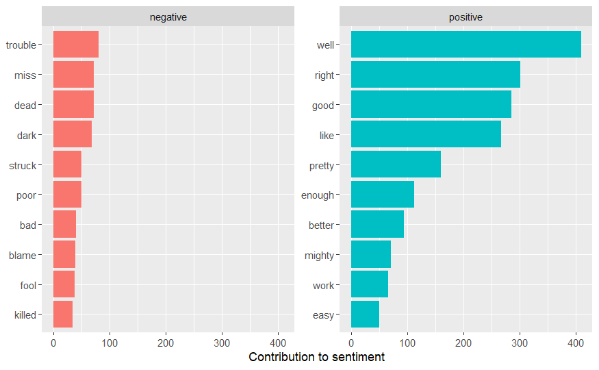
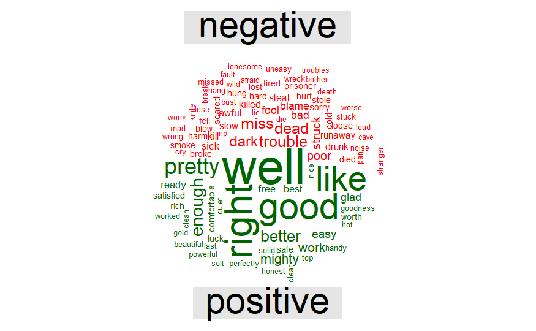

# DATA607 Repository - Data Management Techniques | NLP | Dashboards
This course covered many basics in data management for different purposes. There were two main projects that were quite helpful covered here.

## Dashboard
The focus was puling information from an API, cleaning the data, and allowing user interactable items to view exploratory plots and create models based on their chosen variables. The data was pulled from Valve's API for Dota 2, a highly popular competitive video game with $40 million dollar tournaments.

The dashboard can be found [here](https://hhl7f9-daniel-craig.shinyapps.io/Predicting_Wins_Classification/).

## NLP Data Management Techniques

The in-depth R Pubs Document can be found [here](https://rpubs.com/devcraig/1023099)

This document covers a Sentiment Analysis using Natural Language Processing Techniques (NLP) on Mark Twain's Adventures of Huckleberry Finn.

This document focuses on analyzing the progression of story sentiment (negative or positive) by chapter.

```{r}
ggplot(huckSentiment, aes(x = index, y = sentiment, fill = sentiment)) +
  geom_bar(stat = 'identity') +
  scale_fill_gradient2(low='red', mid='snow3', high='darkgreen', space='Lab') +
  geom_col(show.legend = FALSE)
```


A comparison of sentiment between different lexicons used.


Viewing which words contribute to the sentiment the most.
Week 10 - Sentiment Analysis/plots


